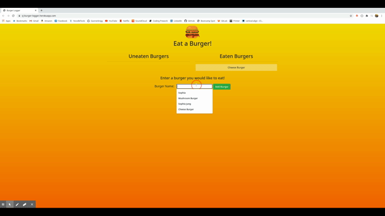

# Burger Logger - Node Express Handlebars
 

## Description
This fullstack application allows a user to input burger names of their choosing and view or "devour" them. The main page consists of a header, a main section that is divided into a left (uneaten) and right (eaten) section, and a input form to add more burger names. Users can "devour" a burger by clicking on the associated "devour" button. This switches the devour boolean value and moves the burger to the other side of the screen. 

This project utilizes Node, Express, MySQL, Handlebars, and ORM (object relational mapping) to create the databases/backend and frontend aspects of this application. 

## Table Of Contents
- [Access and Installation](#Access-and-Installation)
- [Usage](#Usage)
- [Features](#Features)
- [License](#License)
- [Contribution Guidelines](#Contribution-Guidelines)
- [Test Instructions](#Test-Instructions)
- [Questions](#Questions)

## Access and Installation

No external software or servers are necessary to install this project except for a text editor and a working browser. You can git clone this repository to your local computer and open the code files using a text editor. Once the correct npm packages are installed, the program can be run from the command line as long as you are in the same directory as the code files. The repository includes the package.json file needed to install the correct npm pacakges/dependencies. 

This project can be accessed either via the GitHub Repository.

- [GitHub Repository](https://github.com/sophia2798/burger_logger)
- [Deployed Page](https://sj-burger-logger.herokuapp.com/)

To open and edit code files, you will need a text editor. The one used to create this page was Visual Studio Code (https://code.visualstudio.com/).

To install this repository, you can git clone the repository using the green "Code" button. You can copy and paste either the HTML or SSH URL.

## Usage
This project can be add/log types of burger and keep track of which one a user has eaten/not eaten. The information will be maintained through refreshes and different hardware as it uses a database that is connected to the heroku deployment.

This project can also be used as a template to learn more about fullstack coding (how frontend and backend are connected), handlebars, mySQL, and node.

## Features
This project includes...

- mySQL database and table
- Input form for a user to enter a burger name
- Two main sections for eaten and uneaten burgers
- A button to "devour" a burger and move it to the eaten section
- A well organized directory management system
- One front end JavaScript file
- Multiple backend JavaScript files to make backend connections, model, routes, etc.
- Public, static CSS file
- A main and index handlebar files

## License
MIT
A short and simple permissive license with conditions only requiring preservation of copyright and license notices. Licensed works, modifications, and larger works may be distributed under different terms and without source code.

## Contribution Guidelines
Currently, this repository is not set up for contributions. A development branch, to which all merges can be made while protecting the master branch, must be made first. Therefore, please contact the owner(s) of this repository to start and manage such a branch.

Please ensure that PRIOR to any new contributions, you discuss your desired/planned changes via email with the owner(s) of the repository. Contact information can be found in the [Questions](#Questions) section. Changes should be reflected in an updated README as well. To ensure a high quality of code and minimal conflicts, pull requests can only be merged after being approved by another developer. 

To ensure a welcoming working environment, any contributor to this project must help maintain a harassment-free and safe environment. This includes:
    - Using inclusive language
    - Being respectful of various backgrounds and opinions
    - Accepting constructive criticism without aggression or anger
    - Being aware of what benefits the whole community
    - Showing kindness and empathy to one another

## Test Instructions
As the package.json file exists in this repository, only the following line is needed to install the necessary pacakges. The necessary packages are express, mysql, and express-handlebars.

    npm install

To run the program, input the following code into the command line

    npm start
Once you run `npm start`, you can view the live page by visiting the following URL

    localhost:8080

## Questions
If you have any questions, please feel free to reach out via email at sdf. Any further information can be found on my [GitHub Profile](https://github.com/sophia2798) or my [LinkedIn Profile](https://linkedin.com/in/sophia2798).